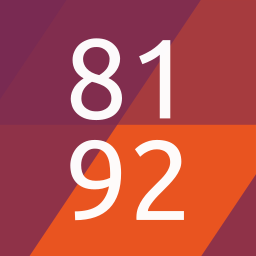

# 8192

A game. About squares. Yeah. I know.
Written in QML for [Ubuntu Touch](https://ubports.com) (Phone and Tablet).

## How to play

Swipe or use the arrow keys to join tiles with the same number. Avoid blockages to achieve the ultimate goal: The 8192 tile!

This game is a QML-rework of Gabriele Cirulli's game "2048", wich was inspired by Jason Saxon's game "1024!", wich was inspired by a board game called "Le 512", invented by King Louis XIV of France in 1657. But keep this in mind, this is important and there will be a test: The concept of "Le 512" was just stolen from a game called "Ye olde 256", played in the pubs of medieval London. Also, some sources state, that Pythagoras used to play a game that he called "128" with his students, wich looks back on the rich tradition of earlier Greek philosophers playing games like "64", "32", "16" and "8". Actually, "8" was just a more complex version of a game called "4", wich was very popular among greek High-School kids. It's not handed down if there is a connection, but archaeological findings show cave-paintings of Neanderthals playing a game, that recent scientific publications refer to as "2".

Yes, i know, the term over-forking does come to mind. But i just wanted to participate in the rich tradition of ripping of games about squares. But it's not all ripped of, i actually changed some of the code, you know, so that's really something. And it uses the Ubuntu Font and color scheme! Did you notice that, did anyone notice that? Wow, right? And what about this note, would you be reading this, if it was not for me? No, you most certainly would not!

## Here's what the press has to say:

10/10 - "Would play again!" - not IGN
11/10 - "I really like the font and color scheme!" - not Mark Shuttleworth
 0/10 - "I already got an app for that" - Any person on the street
 3/10 - "I think I've seen this before" - still not IGN
10/10 - "Your best game so far." - My sister

## How to build

Set up [clickable](https://github.com/bhdouglass/clickable) and run `clickable` inside the working directory.

## Thank you!

A big thanks to Gabriele Cirulli and Jason Saxon for letting me rip off their work. Thanks to Brian Douglass for Clickable. Thanks to the original Creators of Ubuntu Touch, the Ubuntu SDK and the Ubuntu UI toolkit. Thank you to everybody who helps keeping [Ubuntu Touch](https://ubports.com) alive.

## Barely legal Legal Notice

Any who, if you want to be the person to create "16384", go ahead and do so! It's all GPL Licensed, so what's taking you so long? Create that fork! You know you want it!

Well, that escalated quickly. Actually, i just wanted to write a short note about how this game was not actually created by me, and now there is this huge novel. Anyways, have Fun playing and buy the original authors some coffee (or beer, whichever they prefer) if you see them!

Copyright (C) 2017 Jan Jakob Sprinz aka. NeoTheThird
